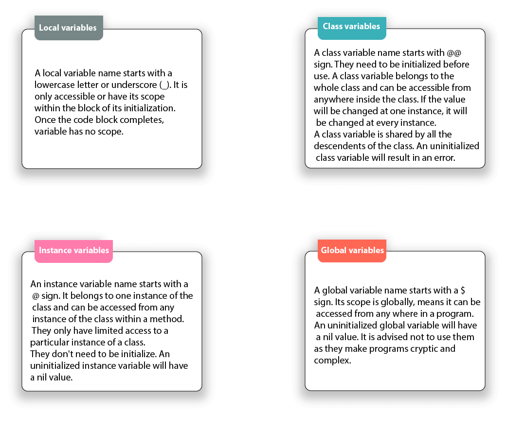

# Ruby variables
Ruby variables are locations which hold data to be used in the programs. Each variable has a different name. These variable names are based on some naming conventions. Unlike other programming languages, there is no need to declare a variable in Ruby. A prefix is needed to indicate it.

## There are four types of variables in Ruby:

  1.Local variables
  2.Class variables
  3.Instance variables
  4.Global variables

  

  

# 1.Local Variables:

Local variables are confined to the scope in which they are defined, such as a method or block.
They start with a lowercase letter or an underscore (_) character. 
Example: `name = "John"`
